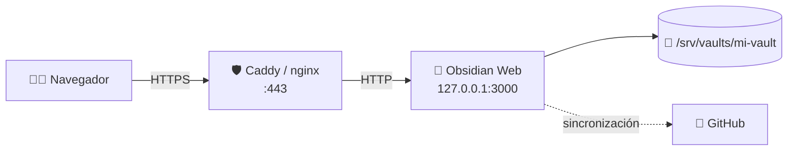
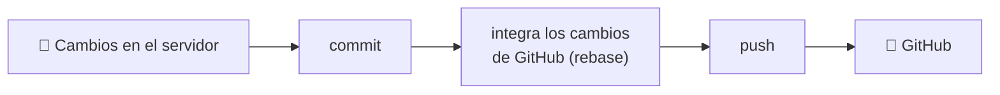

<div align="center">

# 💎 Obsidian Web

### Tu vault de Obsidian, en cualquier navegador.

Visor y editor web **ultraligero** y **autoalojado** para tus notas Markdown.<br>
Instálalo en tu VPS y accede a tu vault desde cualquier dispositivo, con una interfaz fiel a la de Obsidian.

Obsidian Web trabaja directamente sobre la carpeta de tu vault: tus notas siguen siendo archivos `.md`
normales, sin bases de datos ni formatos propios, y puedes seguir abriéndolas con Obsidian de escritorio.
Desde el navegador del portátil del trabajo, una tablet o el móvil puedes escribir con vista previa en vivo,
navegar por tus wikilinks, buscar en todo el vault, editar propiedades y pegar imágenes, y tus cambios se
guardan solos.

Tus notas se quedan en tu servidor, protegidas con contraseña, sesiones revocables y una configuración
segura por defecto. Y si quieres llevarlas a otros dispositivos, puedes sincronizarlas con GitHub desde
la propia web.

<br>

[](https://nodejs.org/)
[](https://www.typescriptlang.org/)
[](https://react.dev/)
[](https://expressjs.com/)
[](https://opensource.org/licenses/MIT)

**[Características](#-características)** ·
**[Inicio rápido](#-inicio-rápido)** ·
**[Despliegue](#-despliegue-en-producción)** ·
**[Sincronización](#-sincronización-con-github)** ·
**[Seguridad](#-seguridad)** ·
**[API](#-api)**

</div>

<br>

> [!TIP]
> **¿Prisa?** `git clone` → `npm install` → `npm start` → abre `http://localhost:3000` y pega el token que aparece en la consola. [Ver inicio rápido ↓](#-inicio-rápido)

---

## 📑 Índice

<table>
<tr>
<td valign="top" width="33%">

**Empezar**
- [✨ Características](#-características)
- [🚀 Inicio rápido](#-inicio-rápido)
- [🔧 Configuración inicial](#-configuración-inicial)
- [🧩 Variables de entorno](#-variables-de-entorno)
- [🌐 Despliegue en producción](#-despliegue-en-producción)

</td>
<td valign="top" width="33%">

**Usar**
- [📝 Uso](#-uso)
- [⚡ Atajos de teclado](#-atajos-de-teclado)
- [🎨 Preferencias](#-preferencias)
- [🔄 Sincronización con GitHub](#-sincronización-con-github)
- [🧰 Mantenimiento](#-mantenimiento)

</td>
<td valign="top" width="33%">

**Referencia**
- [🔒 Seguridad](#-seguridad)
- [📏 Límites](#-límites)
- [📁 Archivos de datos](#-archivos-de-datos)
- [💻 Desarrollo](#-desarrollo)
- [🔌 API](#-api)
- [🩺 Solución de problemas](#-solución-de-problemas)

</td>
</tr>
</table>

---

## ✨ Características

<table>
<tr>
<td width="50%" valign="top">

### ✍️ Escribe como en Obsidian
- Editor **CodeMirror 6** con **vista previa en vivo** (incluidas tablas) o **modo fuente**.
- **Modo lectura** con Markdown renderizado.
- **Autoguardado** mientras escribes (y `Ctrl+S` para forzarlo).
- **Propiedades** (frontmatter YAML) editables, con `tags` y `aliases` como listas.

</td>
<td width="50%" valign="top">

### 🔗 Conecta tus ideas
- **Wikilinks**: `[[nota]]`, `[[nota|alias]]` y `[[nota#encabezado]]`.
- Los enlaces a notas que no existen se ven atenuados y **crean la nota** al pulsarlos.
- **Búsqueda global** en nombres y contenido, con contexto, y por etiqueta con `tag:proyecto`.
- Búsqueda dentro de la nota (`Ctrl+F`).

</td>
</tr>
<tr>
<td valign="top">

### 📂 Organiza tu vault
- **Explorador** con carpetas colapsables y menú contextual.
- **Pestañas**: `Ctrl`/`Cmd` + clic o botón central para abrir en una nueva.
- Duplica, mueve, renombra y borra (a la **papelera** `.trash`, nunca de forma definitiva).
- **Adjuntos**: arrastra o pega imágenes; se guardan donde lo hace Obsidian de escritorio.

</td>
<td valign="top">

### ☁️ Pensado para tu servidor
- **Sincronización con GitHub**, manual o periódica.
- **Exportación a PDF** desde el navegador.
- **Panel lateral** con esquema de encabezados y recuento de palabras.
- **Tema** oscuro, claro o del sistema, y tamaño de fuente ajustable.

</td>
</tr>
</table>

<div align="center">

🔒 **Seguro por defecto** — contraseña con `scrypt` · sesiones revocables · límite de intentos · CSRF · CSP estricta · vault aislado

</div>

---

## 🚀 Inicio rápido

| Necesitas | Detalle |
| :--- | :--- |
| 🟢 **Node.js** | **20 o superior** (20.6+ si quieres usar `--env-file`) y el `npm` que trae. |
| 📁 **Un vault** | Una carpeta del servidor: un vault existente o una carpeta vacía (si no existe, se crea). |
| 🔐 **En producción** | Un dominio y un proxy inverso con HTTPS (Caddy o nginx). Muy recomendado. |

```bash
git clone https://github.com/loft17/Obsidian-Web.git
cd Obsidian-Web
npm install
npm start
```

Abre **`http://localhost:3000`** y sigue la [configuración inicial](#-configuración-inicial).

> [!WARNING]
> **No uses `npm install --omit=dev` ni `--production`.** El frontend se compila con Vite (una dependencia de desarrollo) durante el `postinstall`. Sin ella no se genera `web/dist` y la web aparecerá en blanco.

---

## 🔧 Configuración inicial

Al arrancar por primera vez, el servidor imprime en la consola un **token de un solo uso**:

```text
==================================================
  Token de configuración inicial: 3f9a1c0e7b2d4a6f8e1c9b0d
==================================================
```

Así nadie que llegue antes que tú a la web puede configurarla. Con systemd lo verás con `journalctl -u obsidian-web`; con PM2, con `pm2 logs`.

1. Abre la web y pega el **token de configuración**.
2. Escribe la **ruta absoluta** del vault, por ejemplo `/srv/vaults/mi-vault`.
3. Elige una **contraseña** de al menos **12 caracteres**.
4. Si quieres, cambia el **puerto** (por defecto `3000`).
5. Pulsa **Configurar** e inicia sesión. ¡Listo! 🎉

<details>
<summary><b>🚫 Rutas que no se pueden usar como vault</b></summary>

<br>

Por seguridad, se rechazan:

- Rutas relativas o la raíz `/`.
- Carpetas del sistema y su contenido: `/bin`, `/boot`, `/dev`, `/etc`, `/lib*`, `/proc`, `/run`, `/sbin`, `/snap`, `/sys`, `/usr`, `/var`.
- Carpetas personales completas: `/root`, `/home`, `/home/<usuario>`. Sus subcarpetas sí valen, como `/home/ana/Notas`.
- Cualquier ruta con una carpeta oculta: `~/.ssh`, `~/.config`, `/srv/.vaults/...`.
- La carpeta de la propia app, su carpeta `data/` o cualquier carpeta que las contenga.
- Rutas fuera de `VAULTS_ROOT`, si está definida.

</details>

> [!NOTE]
> **El puerto se guarda en `data/config.json` y tiene prioridad sobre la variable `PORT`.** Para cambiarlo después, edita `"port"` en ese archivo y reinicia. Orden: `config.json` → `PORT` → `3000`.

---

## 🧩 Variables de entorno

El servidor **no carga archivos `.env` por sí solo**. Defínelas en la shell, en la unidad de systemd o en PM2, o usa la opción nativa de Node 20.6+:

```bash
cp .env.example .env && nano .env
node --env-file=.env server/index.js
```

| Variable | Por defecto | Para qué sirve |
| :--- | :--- | :--- |
| `HOST` | todas las interfaces | En producción, **`127.0.0.1`**: así solo el proxy inverso puede conectar. Si no la defines, el servidor te avisa al arrancar. |
| `TRUST_PROXY` | desactivada | **Obligatoria detrás de un proxy inverso** (normalmente `1`). Ver [abajo](#trust_proxy). |
| `VAULTS_ROOT` | sin límite | El vault solo podrá estar dentro de esta carpeta, también al cambiarlo desde *Preferencias*. Ej.: `/srv/vaults`. |
| `PORT` | `3000` | Solo se usa si `data/config.json` no define un puerto, es decir, antes de la configuración inicial. |
| `REMOTE_IMAGES` | desactivada | Con `1` se cargan imágenes `https:` externas en las notas. Ver [Seguridad](#-seguridad). |
| `MAX_UPLOAD_MB`, `MIN_PASSWORD_LENGTH`… | ver [Límites](#-límites) | Tamaño de notas y adjuntos, contraseña, búsqueda y sesiones. |

> [!NOTE]
> `.env.example` incluye también `COOKIE_SECRET` y `NODE_ENV`, pero **el servidor no los usa**: el secreto de las cookies se genera solo en `data/.secret`.

### `TRUST_PROXY`

| Situación | Qué hacer |
| :--- | :--- |
| Accedes **directamente** a la app, sin proxy | **No la definas.** Si lo haces, cualquiera podría falsificar su IP y saltarse el límite de intentos de login. |
| Hay un **proxy inverso** delante (Caddy, nginx…) | **`TRUST_PROXY=1`**. Sin ella, todo lo que guarda algo (login, notas…) devuelve **`403 "Origen no permitido"`**. Con varios proxies encadenados, indica su número (`2`, `3`…) o sus IPs. |

El proxy debe enviar las cabeceras `Host` y `X-Forwarded-Proto`. Caddy lo hace solo; en nginx:

```nginx
proxy_set_header Host              $host;
proxy_set_header X-Forwarded-For   $proxy_add_x_forwarded_for;
proxy_set_header X-Forwarded-Proto $scheme;
```

---

## 🌐 Despliegue en producción



### 1️⃣ Crea un usuario dedicado

> [!CAUTION]
> **No ejecutes la app como root.** Si alguien consiguiera entrar, controlaría todo el servidor. La app te avisa al arrancar si lo haces.

```bash
sudo useradd --system --create-home --home-dir /opt/obsidian-web --shell /usr/sbin/nologin obsidian
sudo mkdir -p /srv/vaults/mi-vault
sudo chown -R obsidian:obsidian /srv/vaults
```

Si sincronizas el vault con otra herramienta (Syncthing, rclone, rsync…), da al usuario `obsidian` permisos de lectura y escritura sobre lo que esta cree, por ejemplo con un grupo común.

### 2️⃣ Instala la app

```bash
sudo -u obsidian -s /bin/bash
cd /opt/obsidian-web
git clone https://github.com/loft17/Obsidian-Web.git app
cd app && npm install
exit
```

### 3️⃣ Crea el servicio systemd

`/etc/systemd/system/obsidian-web.service`:

```ini
[Unit]
Description=Obsidian Web
After=network.target

[Service]
Type=simple
User=obsidian
Group=obsidian
WorkingDirectory=/opt/obsidian-web/app
ExecStart=/usr/bin/node server/index.js
Restart=on-failure
RestartSec=5

Environment=HOST=127.0.0.1
Environment=PORT=3000
Environment=TRUST_PROXY=1
Environment=VAULTS_ROOT=/srv/vaults
# Environment=REMOTE_IMAGES=1

# Endurecimiento opcional
NoNewPrivileges=true
PrivateTmp=true
ProtectSystem=strict
ProtectHome=true
ReadWritePaths=/opt/obsidian-web/app/data /srv/vaults

[Install]
WantedBy=multi-user.target
```

```bash
sudo systemctl daemon-reload
sudo systemctl enable --now obsidian-web
sudo journalctl -u obsidian-web -f     # aquí aparece el token de configuración inicial
```

> [!TIP]
> Si tu vault está en `/home/...`, quita `ProtectHome=true` (o cámbialo por `ProtectHome=read-only`) y añade la ruta a `ReadWritePaths`.

### 4️⃣ Ponle HTTPS delante

<details open>
<summary><b>Opción A — Caddy (recomendada)</b>: certificado automático y sin configuración extra</summary>

<br>

`/etc/caddy/Caddyfile`:

```caddyfile
notas.ejemplo.com {
	reverse_proxy 127.0.0.1:3000
}
```

```bash
sudo systemctl reload caddy
```

</details>

<details>
<summary><b>Opción B — nginx</b></summary>

<br>

`/etc/nginx/sites-available/obsidian-web`:

```nginx
server {
    listen 80;
    server_name notas.ejemplo.com;
    return 301 https://$host$request_uri;
}

server {
    listen 443 ssl http2;
    server_name notas.ejemplo.com;

    ssl_certificate     /etc/letsencrypt/live/notas.ejemplo.com/fullchain.pem;
    ssl_certificate_key /etc/letsencrypt/live/notas.ejemplo.com/privkey.pem;

    # Los adjuntos pueden ocupar hasta 50 MB (el límite por defecto de nginx, 1 MB, da error 413)
    client_max_body_size 50m;

    location / {
        proxy_pass http://127.0.0.1:3000;

        # Imprescindibles junto con TRUST_PROXY=1
        proxy_set_header Host              $host;
        proxy_set_header X-Forwarded-For   $proxy_add_x_forwarded_for;
        proxy_set_header X-Forwarded-Proto $scheme;
    }
}
```

```bash
sudo ln -s /etc/nginx/sites-available/obsidian-web /etc/nginx/sites-enabled/
sudo certbot --nginx -d notas.ejemplo.com   # si aún no tienes certificado
sudo nginx -t && sudo systemctl reload nginx
```

</details>

<details>
<summary><b>Alternativa a systemd — PM2</b></summary>

<br>

```bash
HOST=127.0.0.1 TRUST_PROXY=1 VAULTS_ROOT=/srv/vaults pm2 start server/index.js --name obsidian-web
pm2 save
pm2 startup     # arranque automático con el sistema
pm2 logs obsidian-web
```

</details>

### ✅ Checklist de despliegue

- [ ] La app se ejecuta con un usuario sin privilegios, no como root.
- [ ] `HOST=127.0.0.1`, y el puerto 3000 cerrado en el firewall de todos modos.
- [ ] Proxy inverso con HTTPS delante.
- [ ] `TRUST_PROXY=1` (o el valor adecuado).
- [ ] En nginx: cabeceras `Host` y `X-Forwarded-Proto`, y `client_max_body_size 50m`.
- [ ] `VAULTS_ROOT` definida.
- [ ] Contraseña larga y única.
- [ ] La cookie `token` es `Secure` y la respuesta incluye `Strict-Transport-Security`.
- [ ] Copias de seguridad del vault.

---

## 📝 Uso

### 📂 Explorador y pestañas

| Acción | Resultado |
| :--- | :--- |
| **Clic** en una nota | La abre en la pestaña activa. |
| **`Ctrl`/`Cmd` + clic**, **botón central** o **clic derecho → Abrir en pestaña nueva** | La abre en otra pestaña. |
| **Clic derecho** sobre archivos o carpetas | Nueva nota, nueva carpeta, duplicar, mover, renombrar, borrar. |

Borrar mueve el archivo a `.trash/` dentro del vault. Para recuperarlo, renómbralo en el servidor quitando el sufijo `.<timestamp>.deleted`.

### 🔗 Wikilinks

| Sintaxis | Resultado |
| :--- | :--- |
| `[[Nota]]` | Enlace a `Nota.md`. |
| `[[Nota\|Texto]]` | Enlace con texto alternativo. |
| `[[Nota#Encabezado]]` | Enlace a una sección. |

Un enlace a una nota que no existe se muestra atenuado y, al pulsarlo, se crea la nota. En el editor, `Ctrl`/`Cmd` + clic o el botón central lo abren en otra pestaña.

### 🔍 Búsqueda

- **Texto libre**: busca, sin distinguir mayúsculas, en nombres de archivo y en el contenido. Primero salen las coincidencias por nombre y después las que más apariciones tienen.
- **`tag:proyecto`** o **`tag:#proyecto`**: notas con esa etiqueta, en el frontmatter (`tags:`) o en el texto (`#proyecto`).

### 🖼️ Adjuntos

Arrastra o pega una imagen en el editor. Se guarda en la carpeta de *Preferencias → Archivos* y se inserta el enlace en la nota. Esa carpeta se guarda en `.obsidian/app.json` como `attachmentFolderPath`, igual que en Obsidian de escritorio.

### 🖨️ Exportar a PDF

En el menú de la nota: se abre una versión limpia de la nota (sin frontmatter) y el diálogo de impresión del navegador → *Guardar como PDF*.

---

## ⚡ Atajos de teclado

En Mac, usa <kbd>Cmd</kbd> en lugar de <kbd>Ctrl</kbd>.

| Atajo | Acción |
| :--- | :--- |
| <kbd>Ctrl</kbd> + <kbd>P</kbd> | Abrir nota (buscador rápido) |
| <kbd>Ctrl</kbd> + <kbd>S</kbd> | Guardar la nota ahora |
| <kbd>Ctrl</kbd> + <kbd>E</kbd> | Alternar edición / lectura |
| <kbd>Ctrl</kbd> + <kbd>B</kbd> | Mostrar u ocultar la barra lateral |
| <kbd>Ctrl</kbd> + <kbd>Shift</kbd> + <kbd>F</kbd> | Búsqueda global |
| <kbd>Ctrl</kbd> + <kbd>F</kbd> | Buscar en la nota (<kbd>Enter</kbd>/<kbd>F3</kbd> siguiente, <kbd>Shift</kbd>+<kbd>Enter</kbd>/<kbd>Shift</kbd>+<kbd>F3</kbd> anterior) |
| <kbd>Ctrl</kbd> + rueda / pellizcar | Cambiar el tamaño de fuente (si está activado en *Apariencia*) |
| <kbd>Esc</kbd> | Cerrar menús, diálogos y búsqueda |
| <kbd>↑</kbd> <kbd>↓</kbd> <kbd>Enter</kbd> | Moverse y abrir en el buscador rápido |
| <kbd>Enter</kbd> / <kbd>,</kbd> / <kbd>Retroceso</kbd> | En *Propiedades*: añadir valor / añadir a la lista / borrar el último valor |

---

## 🎨 Preferencias

Se abren desde el icono ⚙️ de engranaje. Las de interfaz se guardan **en el navegador** (`localStorage`), así que son por dispositivo; el resto, **en el servidor**.

| Sección | Opciones | Se guarda en |
| :--- | :--- | :---: |
| 👁️ **Apariencia** | Tema (oscuro / claro / sistema), tamaño de fuente, ajuste rápido con <kbd>Ctrl</kbd>+rueda, barra de título de pestaña, cinta lateral | 🌐 Navegador |
| ✏️ **Editor** | Modo por defecto (visor / edición), modo de edición (vista previa / fuente), título en línea, longitud de línea legible, números de línea | 🌐 Navegador |
| 📂 **Archivos** | Carpeta de adjuntos, ruta del vault (exige la contraseña), carpetas ocultas en el explorador (un patrón por línea, `*` como comodín; esta opción se guarda en el navegador) | 🖥️ Servidor |
| 🔄 **Sincronización** | GitHub: repositorio, rama, token, frecuencia, *Sincronizar ahora* | 🖥️ Servidor |
| 🔒 **Seguridad** | Cambiar la contraseña, cerrar todas las sesiones | 🖥️ Servidor |
| ⌨️ **Atajos** | Lista de atajos | — |

---

## 🔄 Sincronización con GitHub

Mantén el vault del servidor sincronizado con un repositorio de GitHub y, a través de él, con Obsidian de escritorio usando el plugin **Obsidian Git**. **La propia web lo hace todo**: no hay que configurar nada en el servidor (solo hace falta `git` 2.31 o superior).

### Configúrala en 3 pasos

**1. Crea un repositorio privado** en GitHub (**New repository** → *Private*). Puede estar vacío o tener ya tus notas.

**2. Crea un token de acceso**: avatar → **Settings → Developer settings → Personal access tokens → Fine-grained tokens → Generate new token**.

| Campo | Valor |
| :--- | :--- |
| Token name | `Obsidian Web` |
| Expiration | La que prefieras. Cuando caduque, crea otro y pégalo. |
| Repository access | *Only select repositories* → tu repositorio |
| Permissions → Contents | **Read and write** |

Copia el token (empieza por `github_pat_…`): GitHub solo lo muestra una vez.

**3. En la web**, abre **Preferencias → Sincronización**, elige **GitHub**, escribe el repositorio (`usuario/repositorio`), la rama, pega el token, elige la frecuencia y pulsa **Guardar** → **Sincronizar ahora**.

### Cómo funciona



- Puede ser **manual** o **automática**: cada 5, 15 o 30 minutos, cada hora, cada 3 horas o una vez al día. La hace el servidor, así que funciona aunque tengas el navegador cerrado.
- Si una nota cambió **en los dos lados**, se queda la versión del servidor. Si un conflicto no se puede resolver solo, se cancela sin tocar nada y verás el error en *Preferencias*.
- Si el repositorio **ya tenía notas**, la primera vez se combinan con las del servidor sin perder nada.
- La papelera `.trash/` no se sube.
- El token se guarda en `data/sync.json`, **nunca se envía al navegador** y no queda escrito ni en `.git/config` ni en la URL.

> [!IMPORTANT]
> Si tienes una nota abierta y la sincronización trae una versión nueva, **vuelve a abrirla antes de editarla**: el autoguardado guardaría la versión que tienes en pantalla.

> [!TIP]
> ¿Dropbox, Google Drive u otro servidor? Configura `rclone`, `rsync` o similar directamente en el servidor (con cron o un timer de systemd) sobre la carpeta del vault.

---

## 🔒 Seguridad

<table>
<tr>
<td width="50%" valign="top">

#### 🔑 Acceso
- Contraseña única (mín. 12 caracteres) con **`scrypt`** y sal aleatoria; comparación en tiempo constante.
- **Configuración inicial** protegida por un token de un solo uso que solo aparece en la consola.
- **Sesiones revocables**: cookie firmada, `HttpOnly`, `SameSite=Strict` y `Secure` sobre HTTPS, con un token aleatorio del que el servidor solo guarda el hash. Caducan a los **30 días** o tras **7 días sin uso**.
- **Límite de intentos** en el login, el cambio de vault y el de contraseña: 5 fallos en 15 min bloquean la IP 1 min, y el bloqueo se duplica con cada repetición hasta 1 h. Las IPv6 se agrupan por su prefijo /64. Además, 50 fallos en total en 15 min bloquean el login para todos durante 5 min.
- **Cambiar el vault exige la contraseña**, además de la sesión.

</td>
<td width="50%" valign="top">

#### 🌐 Navegador
- **Protección CSRF**: se rechaza lo que venga de otro sitio (`Sec-Fetch-Site: cross-site`) o con un `Origin` distinto del de la web (esquema, dominio y puerto). Por eso `TRUST_PROXY` es obligatoria detrás de un proxy.
- **Cabeceras de seguridad**: CSP estricta (sin scripts externos ni `eval`), `X-Frame-Options: DENY`, `nosniff`, `Referrer-Policy: no-referrer`, `Cross-Origin-Opener-Policy` y HSTS por HTTPS.
- **Imágenes externas bloqueadas**: una imagen de otra web revela tu IP a ese servidor (píxeles de rastreo). Se muestran como imagen rota; actívalas con `REMOTE_IMAGES=1`.
- **SVG seguros**: los archivos del vault se sirven con una CSP *sandbox*, así que un SVG no puede ejecutar scripts.

</td>
</tr>
<tr>
<td valign="top">

#### 📁 Vault
- **Aislamiento**: no se admiten rutas con `../` ni que salgan del vault.
- **Enlaces simbólicos**: no se siguen dentro del vault (no aparecen ni en el explorador ni en la búsqueda). La *raíz* del vault sí puede ser un symlink.
- **`.obsidian/` protegida**: no se puede leer ni modificar desde la web, así nadie puede colar un plugin que se ejecute en tu ordenador al sincronizar.
- **`.git/` protegida**: sus hooks y su configuración ejecutarían código en el servidor al sincronizar.

</td>
<td valign="top">

#### 🖥️ Servidor
- **git seguro**: se lanza sin shell, con los hooks y `core.fsmonitor` desactivados, y solo contra repositorios `https://github.com/…`.
- **Errores sin filtraciones**: las respuestas no incluyen rutas del servidor ni trazas.
- **Avisos al arrancar** si se ejecuta como root o escucha en todas las interfaces por HTTP.
- La carpeta `data/` tiene permisos `700` y sus archivos `600`.

</td>
</tr>
</table>

> [!CAUTION]
> **Sin HTTPS, la contraseña y la cookie viajan sin cifrar.** Úsalo siempre fuera de `localhost`.

---

## 📏 Límites

Todos se cambian con [variables de entorno](#-variables-de-entorno) y requieren reiniciar el servidor. Los valores actuales se ven en *Preferencias → Acerca de*. Un valor no válido (texto, cero o negativo) se ignora con un aviso en la consola.

| Límite | Por defecto | Variable |
| :--- | :--- | :--- |
| Petición JSON (guardar nota, etc.) | 20 MB | `MAX_NOTE_MB` |
| Adjunto subido | 50 MB | `MAX_UPLOAD_MB` |
| Contraseña | mínimo 12 caracteres | `MIN_PASSWORD_LENGTH` |
| Búsquedas | 60 por minuto y por IP (después, `429`) | `SEARCH_RATE_MAX` |
| Longitud de una búsqueda | 200 caracteres | `SEARCH_MAX_QUERY_LENGTH` |
| Notas leídas por búsqueda | se omiten las de más de 2 MB | `SEARCH_MAX_FILE_MB` |
| Total leído por búsqueda | 200 MB | `SEARCH_MAX_SCANNED_MB` |
| Resultados de búsqueda | 200 archivos | `SEARCH_MAX_RESULTS` |
| Coincidencias por archivo | 5 | `SEARCH_MAX_MATCHES_PER_FILE` |
| Duración máxima de una sesión | 30 días | `SESSION_MAX_DAYS` |
| Caducidad por inactividad | 7 días | `SESSION_IDLE_DAYS` |

> [!IMPORTANT]
> Si subes `MAX_UPLOAD_MB` o `MAX_NOTE_MB` y usas nginx, sube también `client_max_body_size` al mayor de los dos; si no, nginx responderá `413` antes de llegar a la app.

> [!NOTE]
> Cambiar el mínimo de contraseña no afecta a la contraseña actual: solo se aplica al crearla o cambiarla.

---

## 📁 Archivos de datos

La carpeta `data/` se crea sola, está en `.gitignore` y el servidor ajusta sus permisos al arrancar (`700` la carpeta, `600` los archivos).

| Archivo | Contenido |
| :--- | :--- |
| `config.json` | `vaultPath`, `passwordHash` (scrypt), `port` y `createdAt`. Se relee en cada petición, así que un cambio de vault se aplica al instante. |
| `.secret` | Secreto aleatorio que firma las cookies. Si se borra, se genera otro y todas las sesiones dejan de valer. |
| `sessions.json` | Hashes SHA-256 de las sesiones activas, con su caducidad y última actividad (nunca los tokens en claro). |
| `sync.json` | Configuración de la sincronización con GitHub, su último estado y el token (si lo hay). |

Dentro del vault, la app solo usa:

| Ruta | Uso |
| :--- | :--- |
| `.trash/` | Papelera: lo borrado se mueve aquí como `nombre.ext.<timestamp>.deleted`. |
| `.obsidian/app.json` | Solo la clave `attachmentFolderPath` (carpeta de adjuntos). |
| `.git/` | Solo con la sincronización con GitHub: el repositorio local (se crea si no existe). |

---

## 🧰 Mantenimiento

### ⬆️ Actualizar

```bash
cd /opt/obsidian-web/app
sudo -u obsidian git pull
sudo -u obsidian npm install      # recompila el frontend
sudo systemctl restart obsidian-web
```

Después, recarga la web con <kbd>Ctrl</kbd> + <kbd>F5</kbd>.

### 💾 Copias de seguridad

- **El vault es lo importante.** Son archivos Markdown normales: cópialos con tu herramienta habitual (rsync, restic, git, Syncthing…).
- `data/` solo guarda configuración y sesiones; si se pierde, basta con repetir la configuración inicial.

### 🔑 He olvidado la contraseña

```bash
sudo systemctl stop obsidian-web
sudo -u obsidian rm /opt/obsidian-web/app/data/config.json
sudo systemctl start obsidian-web
sudo journalctl -u obsidian-web -n 20   # copia el nuevo token de configuración
```

Repite la configuración inicial apuntando al mismo vault: tus notas no se tocan y todas las sesiones anteriores dejan de valer.

### 🚪 Cerrar todas las sesiones sin entrar en la web

Borra `data/sessions.json` (o `data/.secret`) y reinicia el servicio.

---

## 💻 Desarrollo

```bash
npm install
npm run dev
```

Esto levanta a la vez **Vite** en `http://localhost:5173` (frontend con *hot reload*) y **Express** en `http://localhost:3000` (la API, que se reinicia al cambiar `server/`).

> [!IMPORTANT]
> **En desarrollo abre siempre `http://localhost:5173`**, no el 3000. Vite redirige `/api` al backend y así se evitan problemas de CORS y cookies.

| Script | Qué hace |
| :--- | :--- |
| `npm start` | Arranca el servidor (API y `web/dist`). |
| `npm run dev` | Frontend (Vite) + backend con recarga. |
| `npm run web:build` | Compila el frontend en `web/dist` (se ejecuta solo con `npm install`). |
| `npm run web:dev` | Solo el frontend. |
| `npm run server:dev` | Solo la API, con recarga automática. |

### 🧱 Tecnologías

| Capa | Stack |
| :--- | :--- |
| **Backend** | Node.js (ESM), Express 4, `cookie-parser`, `markdown-it` (exportación a PDF), `crypto.scrypt` |
| **Frontend** | React 18, Vite 6, TypeScript, Zustand |
| **Editor** | CodeMirror 6 + Lezer Markdown, con extensiones propias de vista previa en vivo, tablas y wikilinks |
| **Estilos** | CSS propio inspirado en Obsidian (`web/src/styles/obsidian.css`) |

<details>
<summary><b>🗂️ Estructura del proyecto</b></summary>

<br>

```text
Obsidian-Web/
├── server/                  # Backend Node.js + Express
│   ├── index.js             # Punto de entrada: middleware, autenticación, arranque
│   ├── security.js          # Cabeceras de seguridad (CSP, HSTS), CSRF, errores públicos
│   ├── sessions.js          # Sesiones revocables y límite de intentos de login
│   ├── password.js          # Hash y verificación de contraseñas (scrypt)
│   ├── vault.js             # Acceso al sistema de archivos y validación de rutas
│   ├── sync.js              # Sincronización con GitHub (git)
│   └── routes/
│       ├── setup.js         # Configuración inicial
│       ├── auth.js          # Login / logout
│       ├── files.js         # Árbol, lectura, escritura, subida, PDF…
│       ├── search.js        # Búsqueda de texto y etiquetas
│       ├── settings.js      # Vault, contraseña, sesiones, adjuntos
│       └── sync.js          # Configuración y ejecución de la sincronización
├── web/                     # Frontend React + Vite + TypeScript
│   ├── index.html
│   ├── vite.config.ts
│   └── src/
│       ├── components/      # Editor, explorador, pestañas, preferencias…
│       ├── store.ts         # Estado global (Zustand)
│       ├── api.ts           # Cliente de la API
│       ├── livePreview.ts   # Vista previa en vivo (CodeMirror)
│       ├── liveTables.ts    # Tablas en vivo
│       ├── wikilinks.ts     # Resolución de wikilinks
│       └── styles/obsidian.css
├── utils/                   # Documentación técnica y diagnóstico
│   ├── ARQUITECTURA.md
│   ├── TROUBLESHOOTING.md
│   └── diagnose.sh
├── data/                    # Configuración y secretos (autogenerado, en .gitignore)
└── .env.example             # Plantilla de variables de entorno
```

Para el flujo de datos en detalle, consulta [ARQUITECTURA.md](utils/ARQUITECTURA.md).

</details>

---

## 🔌 API

Todas las rutas cuelgan de `/api`. Salvo `setup` y `auth`, exigen una sesión válida (si no, `401`). Las peticiones que no son `GET` pasan la [protección CSRF](#-seguridad). `:filePath` es la ruta relativa al vault, codificada como un solo segmento de URL.

<details>
<summary><b>Ver todas las rutas</b></summary>

<br>

| Método | Ruta | Descripción |
| :---: | :--- | :--- |
| `GET` | `/api/setup/status` | `{ configured }` |
| `POST` | `/api/setup/init` | Configuración inicial (`setupToken`, `vaultPath`, `password`, `port`) |
| `POST` | `/api/auth/login` | Inicia sesión (`password`) |
| `POST` | `/api/auth/logout` | Cierra la sesión actual |
| `GET` | `/api/files/tree` | Árbol del vault |
| `GET` | `/api/files/read/:filePath` | Contenido de una nota |
| `GET` | `/api/files/raw/:filePath` | Archivo binario (imágenes) |
| `GET` | `/api/files/export-pdf/:filePath` | Versión imprimible de la nota |
| `POST` | `/api/files/write/:filePath` | Guarda una nota (`content`) |
| `POST` | `/api/files/upload?note=…&name=…` | Sube un adjunto (cuerpo binario) |
| `DELETE` | `/api/files/:filePath` | Mueve a `.trash/` |
| `POST` | `/api/files/rename` | Renombra o mueve (`oldPath`, `newPath`) |
| `POST` | `/api/files/copy` | Duplica (`path`) |
| `POST` | `/api/files/create-note` | Crea una nota (`path`) |
| `POST` | `/api/files/create-folder` | Crea una carpeta (`path`) |
| `GET` | `/api/search?q=…` | Búsqueda de texto o `tag:` |
| `GET` `POST` | `/api/settings/vault` | Lee / cambia la ruta del vault (`vaultPath`, `password`) |
| `POST` | `/api/settings/password` | Cambia la contraseña (`currentPassword`, `newPassword`) |
| `POST` | `/api/settings/sessions/revoke` | Cierra todas las sesiones |
| `GET` `POST` | `/api/settings/attachments` | Lee / cambia `attachmentFolderPath` |
| `GET` | `/api/sync` | Configuración y estado de la sincronización (sin el token: solo `hasToken`) |
| `POST` | `/api/sync/config` | Cambia la configuración (`provider`, `interval`, `github`; `github.token: null` lo borra) |
| `POST` | `/api/sync/run` | Sincroniza ahora y devuelve el estado al terminar |

</details>

---

## 🩺 Solución de problemas

| Problema | Causa probable y solución |
| :--- | :--- |
| **`403 "Origen no permitido"`** al guardar, entrar, etc. | Estás detrás de un proxy sin `TRUST_PROXY=1`, o nginx no envía `Host`/`X-Forwarded-Proto`. Ver [`TRUST_PROXY`](#trust_proxy). También pasa si entras por un dominio o puerto distinto del que reenvía el proxy. |
| **`403` en la configuración inicial** | Token incorrecto. Cópialo de la consola del servidor (`journalctl -u obsidian-web`). |
| **No encuentro el token de configuración** | Solo aparece si no existe `data/config.json`. Reinicia el servicio y mira los primeros mensajes del log. |
| **`429 Demasiados intentos`** | Límite de intentos de login: espera el tiempo indicado. Si te pasa sin haber fallado, puede que estés detrás de un proxy sin `TRUST_PROXY` y otra IP esté fallando. |
| **`413` al subir una imagen** | nginx limita el cuerpo a 1 MB por defecto: añade `client_max_body_size 50m;`. |
| **Las imágenes externas salen rotas** | Están bloqueadas a propósito. Arranca con `REMOTE_IMAGES=1`. |
| **El puerto no cambia con `PORT`** | `data/config.json` define `"port"` y tiene prioridad. Edítalo y reinicia. |
| **"Esa carpeta no se puede usar como vault"** | Es una ruta del sistema, una carpeta personal completa, una carpeta oculta o la de la app. Usa una subcarpeta normal, como `/srv/vaults/notas`. |
| **"El vault debe estar dentro de …"** | `VAULTS_ROOT` está definida y la ruta queda fuera. |
| **Una carpeta del vault no aparece** | Es un enlace simbólico (no se siguen), su nombre empieza por `.` (`.obsidian/`, `.trash/`, `.git/`… nunca se muestran) o coincide con un patrón de *Preferencias → Archivos → Ocultar carpetas*. |
| **`Permiso denegado`** | El usuario que ejecuta la app no puede leer o escribir en el vault. Revisa propietario y permisos (`chown`/`chmod`). |
| **Error al sincronizar con GitHub (401 / 403)** | El token ha caducado o no tiene permiso *Contents: Read and write* sobre ese repositorio. Crea otro y pégalo en *Preferencias → Sincronización*. |
| **Pantalla en blanco o "Cannot GET /"** | No existe `web/dist`. Ejecuta `npm run web:build` (y no instales con `--omit=dev`). |
| **La sesión se cierra sola** | Han pasado 7 días sin uso o 30 en total, o se cambió la contraseña o se cerraron todas las sesiones. |
| **Las preferencias no se mantienen entre dispositivos** | Las de interfaz se guardan en cada navegador (`localStorage`). |

¿Sigue sin funcionar? Consulta [TROUBLESHOOTING.md](utils/TROUBLESHOOTING.md) o ejecuta el diagnóstico desde la raíz del proyecto:

```bash
chmod +x utils/diagnose.sh
./utils/diagnose.sh
```

---

## 🧭 Hoja de ruta

- [x] Sincronización con GitHub

---

## 📄 Licencia

Distribuido bajo la licencia [MIT](https://opensource.org/licenses/MIT).

<div align="center">

<br>

Hecho con 💜 para quienes viven en su vault de Obsidian.

**[⬆ Volver arriba](#-obsidian-web)**

</div>
