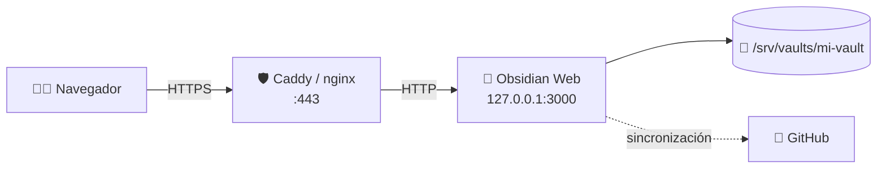
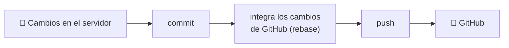

<div align="center">

# 💎 Obsidian Web

### Tu vault de Obsidian, en cualquier navegador.

Visor y editor web **ultraligero** y **autoalojado** para tus notas Markdown.<br>
Instálalo en tu VPS y accede a tu vault desde cualquier dispositivo, con una interfaz fiel a la de Obsidian.

Obsidian Web trabaja directamente sobre la carpeta de tu vault: tus notas siguen siendo archivos `.md`
normales, sin bases de datos ni formatos propios, y puedes seguir abriéndolas con Obsidian de escritorio.
Desde el navegador del portátil del trabajo, una tablet o el móvil puedes escribir con vista previa en vivo,
navegar por tus wikilinks, buscar en todo el vault, editar propiedades y pegar imágenes, y tus cambios se
guardan solos.

Tus notas se quedan en tu servidor, protegidas con contraseña, sesiones revocables y una configuración
segura por defecto. Y si quieres llevarlas a otros dispositivos, puedes sincronizarlas con GitHub desde
la propia web.

<br>

[](https://nodejs.org/)
[](https://www.typescriptlang.org/)
[](https://react.dev/)
[](https://expressjs.com/)
[](https://opensource.org/licenses/MIT)
[](https://claude.com/claude-code)

**[Características](#-características)** ·
**[Inicio rápido](#-inicio-rápido)** ·
**[Despliegue](#-despliegue-en-producción)** ·
**[Sincronización](#-sincronización-con-github)** ·
**[Seguridad](#-seguridad)** ·
**[Documentación técnica](utils/README.md)**

</div>

<br>

> [!TIP]
> **¿Prisa?** `git clone` → `npm install` → `npm start` → abre `http://localhost:3000` y pega el token que aparece en la consola. [Ver inicio rápido ↓](#-inicio-rápido)

---

## 📑 Índice

<table>
<tr>
<td valign="top" width="33%">

**Empezar**
- [✨ Características](#-características)
- [🚀 Inicio rápido](#-inicio-rápido)
- [🔧 Configuración inicial](#-configuración-inicial)
- [🧩 Variables de entorno](#-variables-de-entorno)
- [🌐 Despliegue en producción](#-despliegue-en-producción)

</td>
<td valign="top" width="33%">

**Usar**
- [📝 Uso](#-uso)
- [⚡ Atajos de teclado](#-atajos-de-teclado)
- [🎨 Preferencias](#-preferencias)
- [🔄 Sincronización con GitHub](#-sincronización-con-github)

</td>
<td valign="top" width="33%">

**Referencia**
- [🔒 Seguridad](#-seguridad)
- [📚 Documentación técnica](#-documentación-técnica)
- [🩺 Solución de problemas](utils/TROUBLESHOOTING.md)
- [🧰 Mantenimiento](utils/MANTENIMIENTO.md)

</td>
</tr>
</table>

---

## ✨ Características

<table>
<tr>
<td width="50%" valign="top">

### ✍️ Escribe como en Obsidian
- Editor **CodeMirror 6** con **vista previa en vivo** (incluidas tablas) o **modo fuente**.
- **Modo lectura** con Markdown renderizado y resaltado de sintaxis en los bloques de código.
- **Autoguardado** mientras escribes (y `Ctrl+S` para forzarlo). Si la nota cambia en otro dispositivo, se recarga sola; si además tenías cambios sin guardar, eliges qué versión conservar.
- **Propiedades** (frontmatter YAML) editables, con `tags` y `aliases` como listas.

</td>
<td width="50%" valign="top">

### 🔗 Conecta tus ideas
- **Wikilinks**: `[[nota]]`, `[[nota|alias]]` y `[[nota#encabezado]]`.
- Los enlaces a notas que no existen se ven atenuados y **crean la nota** al pulsarlos.
- **Búsqueda global** en nombres y contenido, con contexto, y por etiqueta con `tag:proyecto`.
- Búsqueda dentro de la nota (`Ctrl+F`).

</td>
</tr>
<tr>
<td valign="top">

### 📂 Organiza tu vault
- **Explorador** con carpetas colapsables y menú contextual.
- **Pestañas**: `Ctrl`/`Cmd` + clic o botón central para abrir en una nueva.
- Duplica, mueve, renombra (los **enlaces se actualizan** solos) y borra a la **papelera** `.trash`, desde donde puedes restaurar.
- **Adjuntos**: arrastra o pega imágenes; se guardan donde lo hace Obsidian de escritorio.
- **Notas diarias y plantillas** desde la cinta, con la misma configuración que Obsidian de escritorio.

</td>
<td valign="top">

### ☁️ Pensado para tu servidor
- **Sincronización con GitHub**, manual o periódica.
- **Exportación a PDF** desde el navegador.
- **Recuento de palabras** y caracteres en la barra de estado.
- **Tema** oscuro, claro o del sistema, y tamaño de fuente ajustable.
- **Idioma** de la interfaz: español, inglés o catalán (por defecto, el del navegador).

</td>
</tr>
</table>

<div align="center">

🔒 **Seguro por defecto** — contraseña con `scrypt` · sesiones revocables · límite de intentos · CSRF · CSP estricta · vault aislado

</div>

---

## 🚀 Inicio rápido

| Necesitas | Detalle |
| :--- | :--- |
| 🟢 **Node.js** | **20 o superior** (20.12+ para que se cargue el `.env`) y el `npm` que trae. |
| 📁 **Un vault** | Una carpeta del servidor: un vault existente o una carpeta vacía (si no existe, se crea). |
| 🔐 **En producción** | Un dominio y un proxy inverso con HTTPS (Caddy o nginx). Muy recomendado. |

```bash
git clone https://github.com/loft17/Obsidian-Web.git
cd Obsidian-Web
npm install
npm start
```

Abre **`http://localhost:3000`** y sigue la [configuración inicial](#-configuración-inicial).

> [!WARNING]
> **No uses `npm install --omit=dev` ni `--production`.** El frontend se compila con Vite (una dependencia de desarrollo) durante el `postinstall`. Sin ella no se genera `web/dist` y la web aparecerá en blanco.

---

## 🔧 Configuración inicial

Al arrancar por primera vez, el servidor imprime en la consola un **token de un solo uso**:

```text
==================================================
  Token de configuración inicial: 3f9a1c0e7b2d4a6f8e1c9b0d
==================================================
```

Así nadie que llegue antes que tú a la web puede configurarla. Con systemd lo verás con `journalctl -u obsidian-web`; con PM2, con `pm2 logs`.

1. Abre la web y pega el **token de configuración**.
2. Escribe la **ruta absoluta** del vault, por ejemplo `/srv/vaults/mi-vault`.
3. Elige una **contraseña** de al menos **12 caracteres**.
4. Si quieres, cambia el **puerto** (por defecto `3000`).
5. Pulsa **Configurar** e inicia sesión. ¡Listo! 🎉

<details>
<summary><b>🚫 Rutas que no se pueden usar como vault</b></summary>

<br>

Por seguridad, se rechazan:

- Rutas relativas o la raíz `/`.
- Carpetas del sistema y su contenido: `/bin`, `/boot`, `/dev`, `/etc`, `/lib*`, `/proc`, `/run`, `/sbin`, `/snap`, `/sys`, `/usr`, `/var`.
- Carpetas personales completas: `/root`, `/home`, `/home/<usuario>`. Sus subcarpetas sí valen, como `/home/ana/Notas`.
- Cualquier ruta con una carpeta oculta: `~/.ssh`, `~/.config`, `/srv/.vaults/...`.
- La carpeta de la propia app, su carpeta `data/` o cualquier carpeta que las contenga.
- Rutas fuera de `VAULTS_ROOT`, si está definida.

</details>

> [!NOTE]
> **El puerto se guarda en `data/config.json` y tiene prioridad sobre la variable `PORT`.** Para cambiarlo después, consulta [MANTENIMIENTO.md](utils/MANTENIMIENTO.md#cambiar-el-puerto).

---

## 🧩 Variables de entorno

Al arrancar, el servidor carga el archivo **`.env`** de la carpeta de la app si existe (requiere Node 20.12+). Tras editarlo, reinicia el servidor:

```bash
cp .env.example .env && nano .env
npm start
```

También puedes definirlas en la shell, en la unidad de systemd o en PM2: **esas tienen prioridad** sobre las del `.env`.

| Variable | Por defecto | Para qué sirve |
| :--- | :--- | :--- |
| `HOST` | todas las interfaces | En producción, **`127.0.0.1`**: así solo el proxy inverso puede conectar. Si no la defines, el servidor te avisa al arrancar. |
| `TRUST_PROXY` | desactivada | **Obligatoria detrás de un proxy inverso** (normalmente `1`). Ver [abajo](#trust_proxy). |
| `VAULTS_ROOT` | sin límite | El vault solo podrá estar dentro de esta carpeta, también al cambiarlo desde *Preferencias*. Ej.: `/srv/vaults`. |
| `PORT` | `3000` | Solo se usa si `data/config.json` no define un puerto, es decir, antes de la configuración inicial. |
| `REMOTE_IMAGES` | desactivada | Con `1` se cargan imágenes `https:` externas en las notas. Ver [Seguridad](#-seguridad). |
| `MAX_UPLOAD_MB`, `MIN_PASSWORD_LENGTH`… | ver [Límites](utils/MANTENIMIENTO.md#límites) | Tamaño de notas y adjuntos (20 MB y 50 MB), contraseña, búsqueda y sesiones. |

### `TRUST_PROXY`

| Situación | Qué hacer |
| :--- | :--- |
| Accedes **directamente** a la app, sin proxy | **No la definas.** Si lo haces, cualquiera podría falsificar su IP y saltarse el límite de intentos de login. |
| Hay un **proxy inverso** delante (Caddy, nginx…) | **`TRUST_PROXY=1`**. Sin ella, todo lo que guarda algo (login, notas…) devuelve **`403 "Origen no permitido"`**. Con varios proxies encadenados, indica su número (`2`, `3`…) o sus IPs. |

El proxy debe enviar las cabeceras `Host` y `X-Forwarded-Proto`. Caddy lo hace solo; en nginx:

```nginx
proxy_set_header Host              $host;
proxy_set_header X-Forwarded-For   $proxy_add_x_forwarded_for;
proxy_set_header X-Forwarded-Proto $scheme;
```

---

## 🌐 Despliegue en producción



### 1️⃣ Crea un usuario dedicado

> [!CAUTION]
> **No ejecutes la app como root.** Si alguien consiguiera entrar, controlaría todo el servidor. La app te avisa al arrancar si lo haces.

```bash
sudo useradd --system --create-home --home-dir /opt/obsidian-web --shell /usr/sbin/nologin obsidian
sudo mkdir -p /srv/vaults/mi-vault
sudo chown -R obsidian:obsidian /srv/vaults
```

Si sincronizas el vault con otra herramienta (Syncthing, rclone, rsync…), da al usuario `obsidian` permisos de lectura y escritura sobre lo que esta cree, por ejemplo con un grupo común.

### 2️⃣ Instala la app

```bash
sudo -u obsidian -s /bin/bash
cd /opt/obsidian-web
git clone https://github.com/loft17/Obsidian-Web.git app
cd app && npm install
exit
```

### 3️⃣ Crea el servicio systemd

`/etc/systemd/system/obsidian-web.service`:

```ini
[Unit]
Description=Obsidian Web
After=network.target

[Service]
Type=simple
User=obsidian
Group=obsidian
WorkingDirectory=/opt/obsidian-web/app
ExecStart=/usr/bin/node server/index.js
Restart=on-failure
RestartSec=5

Environment=HOST=127.0.0.1
Environment=PORT=3000
Environment=TRUST_PROXY=1
Environment=VAULTS_ROOT=/srv/vaults
# Environment=REMOTE_IMAGES=1

# Endurecimiento opcional
NoNewPrivileges=true
PrivateTmp=true
ProtectSystem=strict
ProtectHome=true
ReadWritePaths=/opt/obsidian-web/app/data /srv/vaults

[Install]
WantedBy=multi-user.target
```

```bash
sudo systemctl daemon-reload
sudo systemctl enable --now obsidian-web
sudo journalctl -u obsidian-web -f     # aquí aparece el token de configuración inicial
```

> [!TIP]
> Si tu vault está en `/home/...`, quita `ProtectHome=true` (o cámbialo por `ProtectHome=read-only`) y añade la ruta a `ReadWritePaths`.

### 4️⃣ Ponle HTTPS delante

<details open>
<summary><b>Opción A — Caddy (recomendada)</b>: certificado automático y sin configuración extra</summary>

<br>

`/etc/caddy/Caddyfile`:

```caddyfile
notas.ejemplo.com {
	reverse_proxy 127.0.0.1:3000
}
```

```bash
sudo systemctl reload caddy
```

</details>

<details>
<summary><b>Opción B — nginx</b></summary>

<br>

`/etc/nginx/sites-available/obsidian-web`:

```nginx
server {
    listen 80;
    server_name notas.ejemplo.com;
    return 301 https://$host$request_uri;
}

server {
    listen 443 ssl http2;
    server_name notas.ejemplo.com;

    ssl_certificate     /etc/letsencrypt/live/notas.ejemplo.com/fullchain.pem;
    ssl_certificate_key /etc/letsencrypt/live/notas.ejemplo.com/privkey.pem;

    # Los adjuntos pueden ocupar hasta 50 MB (el límite por defecto de nginx, 1 MB, da error 413)
    client_max_body_size 50m;

    location / {
        proxy_pass http://127.0.0.1:3000;

        # Imprescindibles junto con TRUST_PROXY=1
        proxy_set_header Host              $host;
        proxy_set_header X-Forwarded-For   $proxy_add_x_forwarded_for;
        proxy_set_header X-Forwarded-Proto $scheme;
    }
}
```

```bash
sudo ln -s /etc/nginx/sites-available/obsidian-web /etc/nginx/sites-enabled/
sudo certbot --nginx -d notas.ejemplo.com   # si aún no tienes certificado
sudo nginx -t && sudo systemctl reload nginx
```

</details>

<details>
<summary><b>Alternativa a systemd — PM2</b></summary>

<br>

```bash
HOST=127.0.0.1 TRUST_PROXY=1 VAULTS_ROOT=/srv/vaults pm2 start server/index.js --name obsidian-web
pm2 save
pm2 startup     # arranque automático con el sistema
pm2 logs obsidian-web
```

</details>

### ✅ Checklist de despliegue

- [ ] La app se ejecuta con un usuario sin privilegios, no como root.
- [ ] `HOST=127.0.0.1`, y el puerto 3000 cerrado en el firewall de todos modos.
- [ ] Proxy inverso con HTTPS delante.
- [ ] `TRUST_PROXY=1` (o el valor adecuado).
- [ ] En nginx: cabeceras `Host` y `X-Forwarded-Proto`, y `client_max_body_size 50m`.
- [ ] `VAULTS_ROOT` definida.
- [ ] Contraseña larga y única.
- [ ] La cookie `token` es `Secure` y la respuesta incluye `Strict-Transport-Security`.
- [ ] Copias de seguridad del vault.

Para actualizar, hacer copias de seguridad o recuperar la contraseña, consulta [MANTENIMIENTO.md](utils/MANTENIMIENTO.md).

---

## 📝 Uso

### 📂 Explorador y pestañas

| Acción | Resultado |
| :--- | :--- |
| **Clic** en una nota | La abre en la pestaña activa. |
| **`Ctrl`/`Cmd` + clic**, **botón central** o **clic derecho → Abrir en pestaña nueva** | La abre en otra pestaña. |
| **Clic derecho** sobre archivos o carpetas | Nueva nota, nueva carpeta, duplicar, mover, renombrar, borrar. |

Borrar mueve el archivo a la papelera (`.trash/` dentro del vault). Desde el panel **Papelera** de la cinta puedes restaurarlo a su ruta original, borrarlo definitivamente o vaciar la papelera.

### 🔗 Wikilinks

| Sintaxis | Resultado |
| :--- | :--- |
| `[[Nota]]` | Enlace a `Nota.md`. |
| `[[Nota\|Texto]]` | Enlace con texto alternativo. |
| `[[Nota#Encabezado]]` | Enlace a una sección. |

Un enlace a una nota que no existe se muestra atenuado y, al pulsarlo, se crea la nota. En el editor, `Ctrl`/`Cmd` + clic o el botón central lo abren en otra pestaña.

### 🔍 Búsqueda

- **Texto libre**: busca, sin distinguir mayúsculas, en nombres de archivo y en el contenido. Primero salen las coincidencias por nombre y después las que más apariciones tienen.
- **`tag:proyecto`** o **`tag:#proyecto`**: notas con esa etiqueta, en el frontmatter (`tags:`) o en el texto (`#proyecto`).

### 🖼️ Adjuntos

Arrastra o pega una imagen en el editor. Se guarda en la carpeta de *Preferencias → Archivos* y se inserta el enlace en la nota. Esa carpeta se guarda en `.obsidian/app.json` como `attachmentFolderPath`, igual que en Obsidian de escritorio.

### 📅 Notas diarias y plantillas

Funcionan como los plugins del mismo nombre de Obsidian de escritorio y comparten su configuración, que se cambia en *Preferencias → Archivos* y se guarda en `.obsidian/daily-notes.json` y `.obsidian/templates.json`.

- **Nota diaria** (icono de calendario en la cinta): abre la nota de hoy y, si no existe, la crea en la carpeta configurada con la plantilla elegida. El nombre sale del formato de fecha (sintaxis de moment.js, por defecto `YYYY-MM-DD`); una `/` en el formato crea subcarpetas, por ejemplo `YYYY/MM/YYYY-MM-DD`.
- **Insertar plantilla** (icono de documentos): elige una nota de la carpeta de plantillas y se inserta en el cursor de la nota abierta. Si la plantilla tiene propiedades, se añaden a las de la nota sin cambiar las que ya tenía.
- **Variables**: `{{title}}` (nombre de la nota), `{{date}}` y `{{time}}` (con los formatos configurados), y `{{date:FORMATO}}` / `{{time:FORMATO}}` con un formato propio, por ejemplo `{{date:dddd, D [de] MMMM}}`.

### 🖨️ Exportar a PDF

En el menú de la nota: se abre una versión limpia de la nota (sin frontmatter) y el diálogo de impresión del navegador → *Guardar como PDF*.

---

## ⚡ Atajos de teclado

En Mac, usa <kbd>Cmd</kbd> en lugar de <kbd>Ctrl</kbd>.

| Atajo | Acción |
| :--- | :--- |
| <kbd>Ctrl</kbd> + <kbd>P</kbd> | Abrir nota (buscador rápido) |
| <kbd>Ctrl</kbd> + <kbd>S</kbd> | Guardar la nota ahora |
| <kbd>Ctrl</kbd> + <kbd>E</kbd> | Alternar edición / lectura |
| <kbd>Ctrl</kbd> + <kbd>B</kbd> | Mostrar u ocultar la barra lateral |
| <kbd>Ctrl</kbd> + <kbd>Shift</kbd> + <kbd>F</kbd> | Búsqueda global |
| <kbd>Ctrl</kbd> + <kbd>F</kbd> | Buscar en la nota (<kbd>Enter</kbd>/<kbd>F3</kbd> siguiente, <kbd>Shift</kbd>+<kbd>Enter</kbd>/<kbd>Shift</kbd>+<kbd>F3</kbd> anterior) |
| <kbd>Ctrl</kbd> + rueda / pellizcar | Cambiar el tamaño de fuente (si está activado en *Apariencia*) |
| <kbd>Esc</kbd> | Cerrar menús, diálogos y búsqueda |
| <kbd>↑</kbd> <kbd>↓</kbd> <kbd>Enter</kbd> | Moverse y abrir en el buscador rápido |
| <kbd>Enter</kbd> / <kbd>,</kbd> / <kbd>Retroceso</kbd> | En *Propiedades*: añadir valor / añadir a la lista / borrar el último valor |

---

## 🎨 Preferencias

Se abren desde el icono ⚙️ de engranaje. Las de interfaz se guardan **en el navegador** (`localStorage`), así que son por dispositivo; el resto, **en el servidor**.

| Sección | Opciones | Se guarda en |
| :--- | :--- | :---: |
| 👁️ **Apariencia** | Idioma, tema (oscuro / claro / sistema), tamaño de fuente, ajuste rápido con <kbd>Ctrl</kbd>+rueda, barra de título de pestaña, cinta lateral | 🌐 Navegador |
| ✏️ **Editor** | Modo por defecto (visor / edición), modo de edición (vista previa / fuente), título en línea, longitud de línea legible, números de línea | 🌐 Navegador |
| 📂 **Archivos** | Carpeta de adjuntos, ruta del vault (exige la contraseña), carpetas ocultas en el explorador (un patrón por línea, `*` como comodín; esta opción se guarda en el navegador), notas diarias (formato, carpeta, plantilla) y plantillas (carpeta, formatos de fecha y hora) | 🖥️ Servidor |
| 🔄 **Sincronización** | GitHub: repositorio, rama, token, frecuencia, *Sincronizar ahora* | 🖥️ Servidor |
| 🔒 **Seguridad** | Cambiar la contraseña, cerrar todas las sesiones | 🖥️ Servidor |
| ⌨️ **Atajos** | Lista de atajos | — |

---

## 🔄 Sincronización con GitHub

Mantén el vault del servidor sincronizado con un repositorio de GitHub y, a través de él, con Obsidian de escritorio usando el plugin **Obsidian Git**. **La propia web lo hace todo**: no hay que configurar nada en el servidor (solo hace falta `git` 2.31 o superior).

### Configúrala en 3 pasos

**1. Crea un repositorio privado** en GitHub (**New repository** → *Private*). Puede estar vacío o tener ya tus notas.

**2. Crea un token de acceso**: avatar → **Settings → Developer settings → Personal access tokens → Fine-grained tokens → Generate new token**.

| Campo | Valor |
| :--- | :--- |
| Token name | `Obsidian Web` |
| Expiration | La que prefieras. Cuando caduque, crea otro y pégalo. |
| Repository access | *Only select repositories* → tu repositorio |
| Permissions → Contents | **Read and write** |

Copia el token (empieza por `github_pat_…`): GitHub solo lo muestra una vez.

**3. En la web**, abre **Preferencias → Sincronización**, elige **GitHub**, escribe el repositorio (`usuario/repositorio`), la rama, pega el token, elige la frecuencia y pulsa **Guardar** → **Sincronizar ahora**.

### Cómo funciona



- Puede ser **manual** o **automática**: cada 5, 15 o 30 minutos, cada hora, cada 3 horas o una vez al día. La hace el servidor, así que funciona aunque tengas el navegador cerrado.
- Si una nota cambió **en los dos lados**, se queda la versión del servidor. Si un conflicto no se puede resolver solo, se cancela sin tocar nada y verás el error en *Preferencias*.
- Si el repositorio **ya tenía notas**, la primera vez se combinan con las del servidor sin perder nada.
- La papelera `.trash/` no se sube.
- **Historial de versiones**: en el menú de la nota (⋯ → *Historial de versiones*) ves cada versión guardada en git, qué cambió en ella y puedes restaurarla. Solo incluye lo que ya se ha sincronizado.
- El token se guarda en `data/sync.json`, **nunca se envía al navegador** y no queda escrito ni en `.git/config` ni en la URL.

> [!IMPORTANT]
> Si tienes una nota abierta y la sincronización trae una versión nueva, **vuelve a abrirla antes de editarla**: el autoguardado guardaría la versión que tienes en pantalla.

> [!TIP]
> ¿Dropbox, Google Drive u otro servidor? Configura `rclone`, `rsync` o similar directamente en el servidor (con cron o un timer de systemd) sobre la carpeta del vault.

---

## 🔒 Seguridad

<table>
<tr>
<td width="50%" valign="top">

#### 🔑 Acceso
- Contraseña única (mín. 12 caracteres) con **`scrypt`** y sal aleatoria; comparación en tiempo constante.
- **Configuración inicial** protegida por un token de un solo uso que solo aparece en la consola.
- **Sesiones revocables**: cookie firmada, `HttpOnly`, `SameSite=Strict` y `Secure` sobre HTTPS, con un token aleatorio del que el servidor solo guarda el hash. Caducan a los **30 días** o tras **7 días sin uso**.
- **Límite de intentos** en el login, el cambio de vault y el de contraseña: 5 fallos en 15 min bloquean la IP 1 min, y el bloqueo se duplica con cada repetición hasta 1 h. Las IPv6 se agrupan por su prefijo /64. Además, 50 fallos en total en 15 min bloquean el login para todos durante 5 min.
- **Cambiar el vault exige la contraseña**, además de la sesión.

</td>
<td width="50%" valign="top">

#### 🌐 Navegador
- **Protección CSRF**: se rechaza lo que venga de otro sitio (`Sec-Fetch-Site: cross-site`) o con un `Origin` distinto del de la web (esquema, dominio y puerto). Por eso `TRUST_PROXY` es obligatoria detrás de un proxy.
- **Cabeceras de seguridad**: CSP estricta (sin scripts externos ni `eval`), `X-Frame-Options: DENY`, `nosniff`, `Referrer-Policy: no-referrer`, `Cross-Origin-Opener-Policy` y HSTS por HTTPS.
- **Imágenes externas bloqueadas**: una imagen de otra web revela tu IP a ese servidor (píxeles de rastreo). Se muestran como imagen rota; actívalas con `REMOTE_IMAGES=1`.
- **SVG seguros**: los archivos del vault se sirven con una CSP *sandbox*, así que un SVG no puede ejecutar scripts.

</td>
</tr>
<tr>
<td valign="top">

#### 📁 Vault
- **Aislamiento**: no se admiten rutas con `../` ni que salgan del vault.
- **Enlaces simbólicos**: no se siguen dentro del vault (no aparecen ni en el explorador ni en la búsqueda). La *raíz* del vault sí puede ser un symlink.
- **`.obsidian/` protegida**: no se puede leer ni modificar desde la web, así nadie puede colar un plugin que se ejecute en tu ordenador al sincronizar. Solo se tocan, desde Preferencias, unas pocas claves de `app.json`, `daily-notes.json` y `templates.json`.
- **`.git/` protegida**: sus hooks y su configuración ejecutarían código en el servidor al sincronizar.

</td>
<td valign="top">

#### 🖥️ Servidor
- **git seguro**: se lanza sin shell, con los hooks y `core.fsmonitor` desactivados, y solo contra repositorios `https://github.com/…`.
- **Errores sin filtraciones**: las respuestas no incluyen rutas del servidor ni trazas.
- **Avisos al arrancar** si se ejecuta como root o escucha en todas las interfaces por HTTP.
- La carpeta `data/` tiene permisos `700` y sus archivos `600`.

</td>
</tr>
</table>

> [!CAUTION]
> **Sin HTTPS, la contraseña y la cookie viajan sin cifrar.** Úsalo siempre fuera de `localhost`.

---

## 📚 Documentación técnica

¿Quieres modificar, mejorar o mantener Obsidian Web? Toda la documentación técnica está en la carpeta [`utils/`](utils/README.md):

| Archivo | Contenido |
| :--- | :--- |
| 💻 [DESARROLLO.md](utils/DESARROLLO.md) | Entorno de desarrollo, scripts, convenciones, recetas para cambios habituales y hoja de ruta. **Empieza por aquí.** |
| 🏗️ [ARQUITECTURA.md](utils/ARQUITECTURA.md) | Estructura del código, flujos internos, archivos de `data/` y referencia de la API. |
| 🧰 [MANTENIMIENTO.md](utils/MANTENIMIENTO.md) | Actualizar, copias de seguridad, recuperar la contraseña, variables de entorno y límites. |
| 🩺 [TROUBLESHOOTING.md](utils/TROUBLESHOOTING.md) | Errores frecuentes y cómo reportar un fallo. |
| 🔍 [diagnose.sh](utils/diagnose.sh) | Diagnóstico automático de la instalación: `./utils/diagnose.sh` |

---

## 🤖 Desarrollado con IA

Obsidian Web se ha desarrollado con ayuda de **[Claude](https://claude.com/claude-code)**, la IA de Anthropic, usando Claude Code: tanto el código como la documentación se han escrito y revisado en colaboración con ella.

---

## 📄 Licencia

Distribuido bajo la licencia [MIT](https://opensource.org/licenses/MIT).

<div align="center">

<br>

Hecho con 💜 para quienes viven en su vault de Obsidian.

**[⬆ Volver arriba](#-obsidian-web)**

</div>
