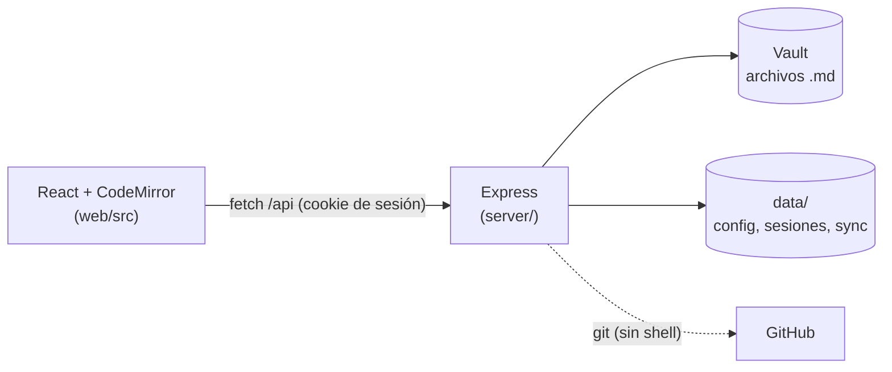
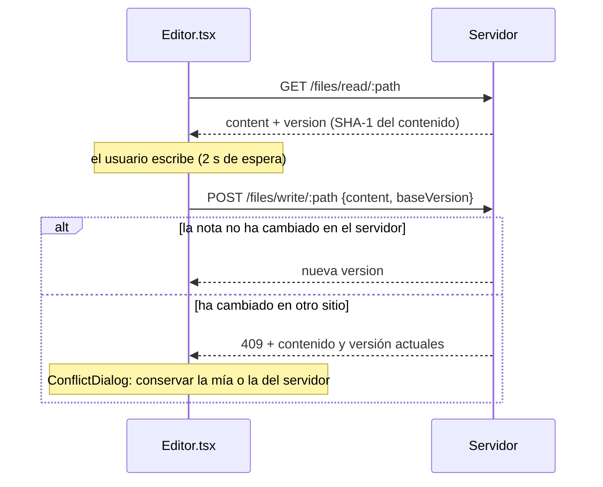

# Arquitectura de Obsidian Web

Cómo está hecho Obsidian Web por dentro. Para instalar y usar la app, consulta el [README](../README.md); para preparar el entorno y hacer cambios, [DESARROLLO.md](DESARROLLO.md).

## Índice

- [Visión general](#visión-general)
- [Tecnologías](#tecnologías)
- [Estructura del proyecto](#estructura-del-proyecto)
- [Flujos principales](#flujos-principales)
- [Seguridad en el código](#seguridad-en-el-código)
- [Archivos de datos](#archivos-de-datos)
- [API](#api)
- [Estado del frontend](#estado-del-frontend)

---

## Visión general

Un único proceso de Node.js sirve a la vez la API (`/api/*`) y el frontend ya compilado (`web/dist`). No hay base de datos: las notas son los archivos `.md` del vault, y la configuración de la app vive en `data/`.



---

## Tecnologías

| Capa | Stack |
| :--- | :--- |
| **Backend** | Node.js ≥ 20 (ESM, sin paso de compilación), Express 4, `cookie-parser`, `markdown-it` (exportación a PDF), `crypto.scrypt` |
| **Frontend** | React 18, Vite 6, TypeScript, Zustand |
| **Editor** | CodeMirror 6 + Lezer Markdown, con extensiones propias de vista previa en vivo, tablas y wikilinks |
| **Lectura** | `markdown-it` con reglas propias: wikilinks, incrustaciones, callouts, `==resaltado==` y `#etiquetas`; `highlight.js` (carga diferida) para los bloques de código |
| **Estilos** | CSS propio inspirado en Obsidian (`web/src/styles/obsidian.css`), con variables para los temas |

Todas las dependencias están en el `package.json` de la raíz. El frontend se compila con Vite en el `postinstall`, por eso las dependencias de desarrollo son necesarias también en producción.

---

## Estructura del proyecto

```text
Obsidian-Web/
├── server/                    # Backend Node.js + Express (ESM, sin compilar)
│   ├── index.js               # Punto de entrada: data/, middleware, montaje de rutas, arranque
│   ├── env.js                 # Carga el .env (process.loadEnvFile)
│   ├── limits.js              # Límites configurables por variables de entorno
│   ├── security.js            # Cabeceras (CSP, HSTS…), protección CSRF, errores públicos
│   ├── sessions.js            # Sesiones revocables y límite de intentos de login
│   ├── password.js            # Hash y verificación de contraseñas (scrypt)
│   ├── vault.js               # Acceso al sistema de archivos: guardPath, papelera, adjuntos, ajustes de .obsidian
│   ├── links.js               # Reescritura de enlaces al renombrar o mover
│   ├── searchIndex.js         # Índice en memoria de las notas para la búsqueda
│   ├── sync.js                # Sincronización con GitHub (git) y sincronización periódica
│   └── routes/
│       ├── setup.js           # Configuración inicial (token de un solo uso)
│       ├── auth.js            # Login / logout
│       ├── files.js           # Árbol, lectura, escritura, subida, papelera, PDF…
│       ├── search.js          # Búsqueda de texto y etiquetas
│       ├── settings.js        # Vault, contraseña, sesiones, adjuntos, notas diarias, límites
│       └── sync.js            # Configuración y ejecución de la sincronización
├── web/                       # Frontend React + Vite + TypeScript
│   ├── index.html             # Incluye un script en línea que aplica el tema antes de pintar
│   ├── public/                # Archivos estáticos copiados tal cual a dist/ (favicon)
│   ├── vite.config.ts
│   └── src/
│       ├── main.tsx           # Punto de entrada de React
│       ├── App.tsx            # Elige pantalla: configuración, login o app
│       ├── store.ts           # Estado global (Zustand) y preferencias en localStorage
│       ├── api.ts             # Cliente de la API
│       ├── frontmatter.ts     # Leer y escribir el frontmatter YAML
│       ├── wikilinks.ts       # Resolver y seguir [[enlaces]]
│       ├── wikilinkComplete.ts# Autocompletado de [[ en el editor
│       ├── noteEmbeds.ts      # Caché de notas incrustadas con ![[nota]]
│       ├── attachments.ts     # Rutas y tamaños de imágenes y adjuntos
│       ├── imageUpload.ts     # Pegar / arrastrar imágenes en el editor
│       ├── templates.ts       # Notas diarias y plantillas ({{date}}, {{title}}…)
│       ├── livePreview.ts     # Vista previa en vivo (decoraciones de CodeMirror)
│       ├── liveTables.ts      # Tablas en vivo
│       ├── codeHighlight.ts   # Resaltado de bloques de código en lectura (highlight.js bajo demanda)
│       ├── mermaidDiagrams.ts # Diagramas ```mermaid en lectura (Mermaid bajo demanda, SVG en caché)
│       ├── components/
│       │   ├── MainLayout.tsx # Disposición, atajos globales, carga de notas, cambios externos
│       │   ├── Editor.tsx     # CodeMirror, autoguardado, versiones y conflictos
│       │   ├── EditorToolbar.tsx
│       │   ├── ReadingView.tsx# Modo lectura (markdown-it con reglas propias)
│       │   ├── Properties.tsx # Editor de propiedades (frontmatter)
│       │   ├── InlineTitle.tsx# Título editable que renombra la nota
│       │   ├── FileExplorer.tsx, Tabs.tsx, Ribbon.tsx, StatusBar.tsx
│       │   ├── SearchPanel.tsx, TagsPanel.tsx, TrashPanel.tsx
│       │   ├── FileDialogs.tsx# Buscador rápido, diálogo de conflicto, diálogos de archivo
│       │   ├── NoteMenu.tsx   # Menú de la nota (exportar a PDF, mover, borrar…)
│       │   ├── SettingsModal.tsx
│       │   ├── Setup.tsx, Login.tsx, ImageViewer.tsx, Icons.tsx
│       └── styles/obsidian.css
├── utils/                     # Documentación técnica y diagnóstico
│   ├── README.md              # Índice de esta carpeta
│   ├── DESARROLLO.md          # Entorno, convenciones, recetas y hoja de ruta
│   ├── ARQUITECTURA.md        # Este archivo
│   ├── MANTENIMIENTO.md       # Actualizar, copias, contraseña, variables y límites
│   ├── TROUBLESHOOTING.md     # Errores frecuentes
│   └── diagnose.sh            # Diagnóstico automático
├── data/                      # Configuración y secretos (autogenerado, en .gitignore)
├── .env.example               # Plantilla de variables de entorno
└── package.json               # Dependencias y scripts de todo el proyecto
```

---

## Flujos principales

### Arranque y autenticación

1. `server/index.js` crea `data/` (permisos `700`/`600`), carga o genera `data/.secret` para firmar las cookies y monta las rutas.
2. Si no existe `data/config.json`, `routes/setup.js` genera un **token de un solo uso** y lo imprime en la consola.
3. En el navegador, `App.tsx` llama a `/api/setup/status`:
   - Sin configurar → `Setup.tsx` → `POST /api/setup/init` con el token, la ruta del vault y la contraseña. El servidor valida la ruta (`vault.checkVaultPath`) y guarda el hash scrypt en `config.json`.
   - Configurado → intenta `GET /api/files/tree`; si responde `401`, muestra `Login.tsx`.
4. `POST /api/auth/login` verifica la contraseña (`password.js`) y crea una sesión (`sessions.js`): la cookie firmada `token` lleva un valor aleatorio y en `data/sessions.json` solo se guarda su SHA-256.
5. Todo `/api` salvo `setup` y `auth` pasa por el middleware de sesión de `index.js`. `getConfig()` relee `config.json` en cada petición, así que un cambio de vault se aplica al instante.

### Abrir y guardar una nota



- `MainLayout.tsx` carga la nota al cambiar de pestaña y guarda su versión en `noteVersions` (`Editor.tsx`).
- El autoguardado se lanza a los 2 s sin escribir. `Ctrl+S` (`flushPendingSave`) lo adelanta. Antes de renombrar, mover o borrar se vacían los guardados pendientes.
- `vault.writeFile` solo escribe si la versión del disco coincide con `baseVersion`. Si no coincide, lanza `ConflictError` y la ruta responde `409`; el cliente abre `ConflictDialog`.

### Cambios hechos fuera de esta pestaña

`MainLayout.tsx` vuelve a leer la nota abierta cada 15 s mientras la pestaña está visible, al volver a ella y al recibir el evento `NOTES_CHANGED`. Si la versión ha cambiado y no hay cambios sin guardar, sustituye el contenido; si los hay, no toca nada y será el guardado el que detecte el conflicto.

### Renombrar y mover

`POST /api/files/rename` llama a `links.prepareLinkUpdate` **antes** de mover: resuelve cada enlace del vault con el árbol antiguo. Después de mover reescribe los que ya no llegan a su destino (`[[wikilinks]]`, `![[incrustaciones]]` y `[enlaces](markdown)`) y devuelve las notas modificadas. El cliente lanza `NOTES_CHANGED` para recargar la nota abierta y las incrustaciones.

> [!IMPORTANT]
> La resolución de wikilinks está **duplicada** en `web/src/wikilinks.ts` (cliente) y `server/links.js` (servidor), y deben comportarse igual: ruta exacta desde la raíz, relativa a la nota y, por último, por nombre en cualquier carpeta (la más cercana a la nota). Si cambias una, cambia la otra.

### Modo lectura e incrustaciones

`ReadingView.tsx` configura una instancia de `markdown-it` (`html: false`) con reglas propias: `[[wikilinks]]` (atenuados si no existen), `![[imagen]]` con tamaño, `![[nota]]` / `![[nota#encabezado]]`, callouts `> [!tipo]`, `==resaltado==`, `#etiquetas` y bloques de código con botón de copiar y resaltado de sintaxis (`codeHighlight.ts`, que descarga highlight.js solo cuando una nota tiene código). Los bloques ` ```mermaid ` se convierten en diagramas con `mermaidDiagrams.ts`, que también descarga Mermaid bajo demanda, lo usa con `securityLevel: 'strict'` (etiquetas saneadas, sin clics con JavaScript) y guarda los SVG en caché por tema. Mermaid mete `<style>` en cada SVG, lo que la CSP ya permite con `style-src 'unsafe-inline'`; no usa `eval`, así que `script-src` no cambia.

El render es síncrono, así que las notas incrustadas se piden en segundo plano a `noteEmbeds.ts`. Al llegar, avisa (`useSyncExternalStore`) y la vista se vuelve a pintar. La profundidad máxima de incrustación es 4, y una nota no puede incrustarse a sí misma en bucle.

### Búsqueda y etiquetas

`routes/search.js` busca sobre el índice en memoria de `searchIndex.js`. En cada consulta se recorre el árbol del vault (solo `stat`) y se vuelven a leer únicamente las notas cuya fecha de modificación o tamaño han cambiado; así el índice recoge lo guardado desde la web, la sincronización con GitHub y los cambios hechos fuera de la app, sin vigilar la carpeta. Se construye en la primera búsqueda. Los límites de `limits.js` siguen aplicándose: tamaño por archivo, total indexado, resultados, coincidencias y peticiones por minuto. `tag:` busca en la propiedad `tags` del frontmatter y en las `#etiquetas` del cuerpo, fuera de bloques de código. `GET /api/search/tags` usa el mismo índice para el panel de etiquetas; las etiquetas de cada nota se calculan una vez por versión.

### Papelera

`vault.deleteFile` mueve el elemento a `.trash/` como `nombre.ext.<timestamp>.deleted` y apunta su ruta original en `.trash/.index.json`. `TrashPanel.tsx` permite restaurarlo a esa ruta, borrarlo definitivamente o vaciar la papelera.

### Sincronización con GitHub

`server/sync.js` ejecuta `git` con `spawn` y sin shell: commit de los cambios locales → `fetch` → `rebase -X theirs` sobre la rama remota (en un conflicto gana la versión del servidor; si aun así falla, `rebase --abort`) → `push`. Toda la configuración de git va en variables `GIT_CONFIG_*` del proceso; el token viaja como cabecera `extraHeader` en ellas, nunca en la URL ni en `.git/config`, y se elimina de los mensajes de error. Un temporizador comprueba cada minuto si toca la sincronización periódica según `interval`.

**Historial de versiones.** Con la sincronización activa, `noteHistory` saca de `git log --follow` los commits que tocaron una nota (siguiendo los renombrados, hasta 200) y `noteAtCommit` devuelve su contenido en uno de ellos (`git cat-file`) y el diff de ese commit (`git show`, sin `textconv` ni diff externos). Las rutas se pasan con `GIT_LITERAL_PATHSPECS=1` y el commit pedido tiene que estar en el historial de la nota. `HistoryDialog` (en `FileDialogs.tsx`, desde el menú de la nota) lo muestra; restaurar es un guardado normal con la versión conocida, así que no pisa cambios hechos en otro sitio.

---

## Seguridad en el código

Qué hace cada medida está en el README ([Seguridad](../README.md#-seguridad)). Aquí, dónde está cada una. Si tocas alguno de estos archivos, revisa que la medida sigue en pie:

| Medida | Dónde |
| :--- | :--- |
| Rutas dentro del vault, sin `../`, sin symlinks hacia fuera, `.obsidian/` y `.git/` protegidas | `vault.js` → `guardPath()`. **Toda** ruta que llega del cliente debe pasar por aquí. |
| Rutas válidas para un vault (sin carpetas del sistema ni de la app, `VAULTS_ROOT`) | `vault.js` → `checkVaultPath()` |
| CSP, HSTS y demás cabeceras; hashes CSP de los scripts en línea de `index.html` | `security.js` → `securityHeaders()` |
| CSRF (`Sec-Fetch-Site` y `Origin`) | `security.js` → `csrfGuard` |
| Errores sin rutas internas ni trazas | `security.js` → `publicError()` y el manejador de errores de `index.js` |
| Sesiones revocables y límite de intentos | `sessions.js` |
| Contraseñas (scrypt, comparación en tiempo constante) | `password.js` |
| `git` sin hooks ni `core.fsmonitor`, solo `https://github.com/` | `sync.js` |
| Archivos del vault servidos con CSP *sandbox* (SVG) | `routes/files.js` → `/raw` |

---

## Archivos de datos

La carpeta `data/` se crea sola, está en `.gitignore` y el servidor ajusta sus permisos al arrancar (`700` la carpeta, `600` los archivos).

| Archivo | Contenido |
| :--- | :--- |
| `config.json` | `vaultPath`, `passwordHash` (scrypt: 16 bytes de sal + 32 de hash, en hexadecimal), `port` y `createdAt`. Se relee en cada petición. |
| `.secret` | Secreto aleatorio que firma las cookies. Si se borra, se genera otro y todas las sesiones dejan de valer. |
| `sessions.json` | Hashes SHA-256 de las sesiones activas, con su caducidad y última actividad (nunca los tokens en claro). La actividad se guarda en disco como mucho una vez por hora. |
| `sync.json` | Configuración de la sincronización con GitHub, su último estado y el token (si lo hay). |

Dentro del vault, la app solo usa:

| Ruta | Uso |
| :--- | :--- |
| `.trash/` | Papelera: `nombre.ext.<timestamp>.deleted`, con las rutas originales en `.trash/.index.json`. |
| `.obsidian/app.json` | Solo la clave `attachmentFolderPath` (carpeta de adjuntos). |
| `.obsidian/daily-notes.json` | Claves `folder`, `format` y `template` (notas diarias). |
| `.obsidian/templates.json` | Claves `folder`, `dateFormat` y `timeFormat` (plantillas). |
| `.git/` | Solo con la sincronización con GitHub: el repositorio local (se crea si no existe). |

---

## API

Todas las rutas cuelgan de `/api`. Salvo `setup` y `auth`, exigen una sesión válida (si no, `401`). Las peticiones que no son `GET` pasan la protección CSRF. `:filePath` es la ruta relativa al vault, codificada como un solo segmento de URL.

| Método | Ruta | Descripción |
| :---: | :--- | :--- |
| `GET` | `/api/setup/status` | `{ configured }` |
| `POST` | `/api/setup/init` | Configuración inicial (`setupToken`, `vaultPath`, `password`, `port`) |
| `POST` | `/api/auth/login` | Inicia sesión (`password`) |
| `POST` | `/api/auth/logout` | Cierra la sesión actual |
| `GET` | `/api/files/tree` | Árbol del vault (lista plana de `{ type, path, name }`, y `size` en los archivos) |
| `GET` | `/api/files/read/:filePath` | Contenido de una nota y su versión (`content`, `version`) |
| `GET` | `/api/files/raw/:filePath` | Archivo binario (imágenes, adjuntos) |
| `GET` | `/api/files/export-pdf/:filePath` | Versión imprimible de la nota |
| `POST` | `/api/files/write/:filePath` | Guarda una nota (`content`, `baseVersion` opcional). `409` con la versión actual si ha cambiado desde `baseVersion` |
| `POST` | `/api/files/upload?note=…&name=…` | Sube un adjunto (cuerpo binario); devuelve su `path` |
| `DELETE` | `/api/files/:filePath` | Mueve a `.trash/` |
| `GET` | `/api/files/trash` | Contenido de la papelera |
| `POST` | `/api/files/trash/restore` | Restaura a su ruta original (`id`) |
| `POST` | `/api/files/trash/delete` | Borra definitivamente (`id`) |
| `POST` | `/api/files/trash/empty` | Vacía la papelera |
| `POST` | `/api/files/rename` | Renombra o mueve (`oldPath`, `newPath`) y actualiza los enlaces; devuelve las notas modificadas (`updated`) |
| `POST` | `/api/files/copy` | Duplica (`path`) |
| `POST` | `/api/files/create-note` | Crea una nota (`path`, `content` opcional) |
| `POST` | `/api/files/create-folder` | Crea una carpeta (`path`) |
| `GET` | `/api/search?q=…` | Búsqueda de texto o `tag:` |
| `GET` | `/api/search/tags` | Todas las etiquetas del vault con las notas que las usan (`{ tag, paths }`) |
| `GET` `POST` | `/api/settings/vault` | Lee / cambia la ruta del vault (`vaultPath`, `password`) |
| `GET` | `/api/settings/limits` | Límites actuales del servidor (solo lectura) |
| `POST` | `/api/settings/password` | Cambia la contraseña (`currentPassword`, `newPassword`) |
| `POST` | `/api/settings/sessions/revoke` | Cierra todas las sesiones |
| `GET` `POST` | `/api/settings/attachments` | Lee / cambia `attachmentFolderPath` |
| `GET` `POST` | `/api/settings/notes` | Lee / cambia la configuración de notas diarias (`dailyNotes`) y plantillas (`templates`) |
| `GET` | `/api/sync` | Configuración y estado de la sincronización (sin el token: solo `hasToken`) |
| `POST` | `/api/sync/config` | Cambia la configuración (`provider`, `interval`, `github`; `github.token: null` lo borra) |
| `POST` | `/api/sync/run` | Sincroniza ahora y devuelve el estado al terminar |
| `GET` | `/api/sync/history?path=` | Commits que han tocado la nota (fecha, autor, mensaje y ruta en ese commit) |
| `GET` | `/api/sync/history/version?path=&commit=` | Contenido de la nota en ese commit y su diff |

> [!NOTE]
> Las acciones de la papelera van por `POST` y no por `DELETE` para no chocar con `DELETE /api/files/:filePath` cuando una nota se llama `trash`.

---

## Estado del frontend

`web/src/store.ts` (Zustand) guarda:

- **Vault y navegación**: `tree` (lista plana del vault), `tabs` (`{ path, name, isDirty }`), `activeTab`, `expandedFolders`, `sidebarView` (`files`, `search`, `tags` o `trash`) y `searchQuery`.
- **Edición**: `editMode` (edición o lectura) y `conflicts` (conflictos de guardado pendientes, se muestran de uno en uno).
- **Preferencias de interfaz**: tema, tamaño de fuente, modo del editor (`preview` / `source`), título en línea, números de línea, longitud de línea legible, cinta, cabecera de pestaña y carpetas ocultas. Se guardan en `localStorage`, así que son **por navegador**.

Fuera del store, en `Editor.tsx`, viven `noteVersions` (versión conocida de cada nota) y los guardados pendientes y en curso.

---

Las convenciones de código y las recetas para cambios habituales están en [DESARROLLO.md](DESARROLLO.md).
